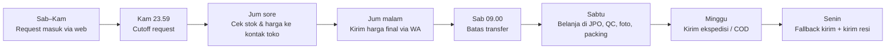
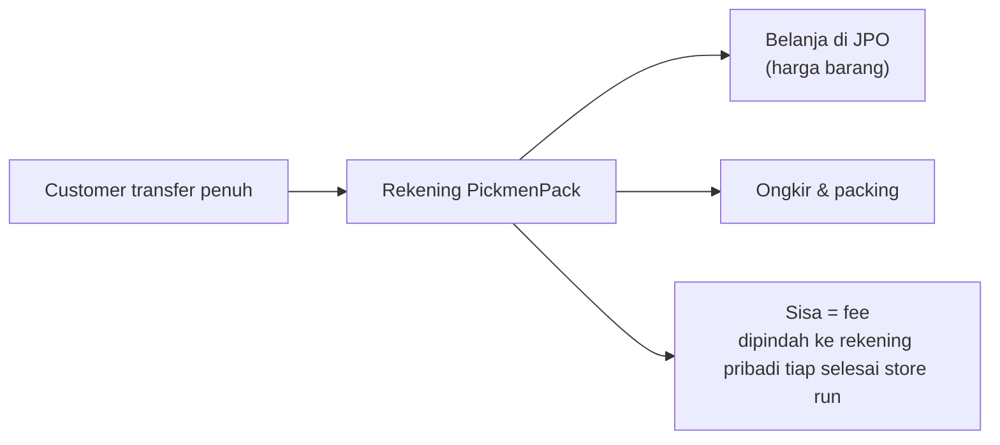

## Document Control

| Field | Value |
|---|---|
| Project Name | PickmenPack |
| Document Type | Business Operations — SOP, Policy & Legal |
| Version | v0.1 |
| Status | Draft — keputusan Owner 2 Okt 2026, dipublish ke Notion 2 Okt 2026 |
| Owner | Dicky Qadr Alamsah |
| Related Document | Business & Market Research (vault) v1.0 · [PRD](PRD.md) v1.1 · Unit Economics (vault) |
| Primary Purpose | Aturan main operasional PickmenPack sehari-hari: siklus mingguan, kebijakan harga/stok/refund/retur, rekening, dan legalitas dasar |

> [!info] Business Operations — PickmenPack
> *Kalau PRD menjawab "produknya apa", dokumen ini menjawab "bisnisnya dijalankan bagaimana": jadwal mingguan yang muat dengan jam kerja kantor, apa yang terjadi kalau stok habis atau ukuran salah, uang customer disimpan di mana, dan legalitas apa yang perlu disiapkan untuk jasa jastip perorangan.*

---

## Table of Contents

- [1. Prinsip Operasional](#1-prinsip-operasional)
- [2. Siklus Mingguan (Weekly Cycle)](#2-siklus-mingguan-weekly-cycle)
- [3. Onboarding Toko — Store Run Pertama](#3-onboarding-toko--store-run-pertama)
- [4. Pricing Policy — Rentang di Katalog, Harga Pasti Sebelum Bayar](#4-pricing-policy--rentang-di-katalog-harga-pasti-sebelum-bayar)
- [5. Stock, Refund & Return Policy](#5-stock-refund--return-policy)
- [6. Payment & Bank Account](#6-payment--bank-account)
- [7. Legal & Compliance](#7-legal--compliance)
- [8. Open Questions](#8-open-questions)
- [9. Revision History](#9-revision-history)

---

# 1. Prinsip Operasional

| # | Prinsip | Artinya di lapangan |
|---|---|---|
| 1 | **Jasa jastip, bukan toko atau corporate** | PickmenPack dibayar untuk jasanya (fee). Semua pesanan — sedikit atau banyak — ikut aturan yang sama: bayar penuh dulu, tanpa tempo, tanpa invoice resmi/faktur ala B2B |
| 2 | **Meringankan dua pihak** | Customer tidak kena biaya apa pun kalau batal sebelum transfer. Admin tidak pernah keluar modal sebelum customer bayar |
| 3 | **Website yang mengantre, bukan WhatsApp** | Customer mengisi request sendiri di web, jadi daftar pesanan rapi tanpa harus dibalas satu per satu di jam kerja. WhatsApp dipakai untuk konfirmasi harga dan closing |
| 4 | **Ada pesanan = jalan** | Selama ada minimal satu pesanan terbayar di minggu itu, store run Sabtu tetap jalan |

---

# 2. Siklus Mingguan (Weekly Cycle)

Senin–Jumat Dicky kerja kantor, jadi semua aktivitas yang butuh ke lapangan ditaruh di akhir pekan. Jumat jadi hari kunci karena pulang lebih awal (sekitar 15.30–16.00).

| Hari | Aktivitas | Catatan |
|---|---|---|
| **Sabtu–Kamis** | Request masuk lewat form web, otomatis tersimpan dan dapat pesan konfirmasi ("dibalas paling lambat Jumat malam") | Tidak wajib membalas real-time. Pertanyaan singkat di WA cukup dibalas malam hari (usulan: 19.00–21.00) |
| **Kamis 23.59** | **Cutoff** — request setelah ini masuk store run minggu depan | Ditampilkan di web bareng jadwal store run berikutnya |
| **Jumat sore** | Cek ketersediaan & harga pasti ke kontak toko via WA (Section 3), sekaligus rekap semua request minggu itu | Pulang kantor lebih awal, jadi waktu ini paling longgar |
| **Jumat malam** | Kirim harga final + rincian ke tiap customer via WA | Harga selalu di dalam rentang katalog (Section 4) |
| **Sabtu 09.00** | **Batas transfer** — yang belum transfer otomatis ikut minggu depan, tanpa biaya | Usulan jam; menjawab PRD Open Question #3 |
| **Sabtu** | Belanja di JPO hanya untuk pesanan yang sudah lunas → QC → foto/video → packing | Satu kali kunjungan untuk semua pesanan |
| **Minggu** | Kirim lewat ekspedisi (kalau agen buka) atau COD lokal | Foto resi dikirim ke customer |
| **Senin** | Fallback: kirim paket yang belum terkirim (sebelum/sesudah kerja) | Lead time yang dijanjikan ke customer: barang dikirim paling lambat Senin setelah store run |

> [!note] Kenapa begini lebih aman daripada full WhatsApp
> *Dengan cutoff Kamis dan batch Jumat, semua kerja balas-membalas terkumpul di satu sore, bukan tersebar di jam kantor. Customer juga tahu sejak awal kapan dibalas dan kapan barangnya dibeli, jadi tidak perlu menagih-nagih lewat chat.*

> [!warning] Kalau ada yang buru-buru
> *PRD Section 5.8 masih membuka opsi "dilayani di luar jadwal reguler". Dengan jadwal kantor sekarang, opsi ini realistisnya cuma Jumat sore — perlu diputuskan apakah tetap ditawarkan (lihat Section 8).*

---

# 3. Onboarding Toko — Store Run Pertama

Store run pertama wajib datang langsung ke JPO. Tujuannya tiga sekaligus:

1. **Belanja pesanan pertama.**
2. **Minta kontak WhatsApp** SPG/counter di tiap toko yang sering dipakai, supaya cek stok & harga minggu-minggu berikutnya cukup lewat chat di Jumat sore.
3. **Tanya kebijakan toko** — diskon yang sedang jalan, kebijakan retur/tukar untuk barang cacat, dan apakah barang bisa di-*hold* sebentar.

| Toko / Counter | Kontak (nama & WA) | Kebijakan retur cacat | Bisa hold barang? | Catatan diskon |
|---|---|---|---|---|
| _isi saat store run pertama_ | | | | |

> [!tip] Simpan di satu tempat
> *Tabel di atas bisa diisi langsung di sini atau dipindah ke halaman Pengaturan admin nanti. Yang penting satu sumber, karena ini yang dipakai tiap Jumat sore.*

---

# 4. Pricing Policy — Rentang di Katalog, Harga Pasti Sebelum Bayar

1. **Katalog menampilkan rentang harga** per item (bukan satu angka), karena diskon toko bisa berubah tiap minggu.
2. Setelah cek ke toko (Jumat sore), admin mengirim **harga pasti** yang sudah sesuai dengan yang tertera di toko + fee (PRD Section 5.4).
3. Harga yang sudah dikonfirmasi dan dibayar **tidak berubah lagi** — tidak ada tagihan susulan.

| Kondisi | Yang terjadi |
|---|---|
| Harga toko di dalam rentang katalog | Normal — dikonfirmasi ke customer, lanjut transfer |
| Harga toko di bawah rentang (diskon tambahan) | Customer bayar harga yang lebih murah — jadi bahan konten "harga miring" |
| Harga toko di atas rentang (jarang) | Disampaikan apa adanya; customer bebas batal tanpa biaya |

Format rincian ke customer (sama dengan BMR Section 5.5):

`Harga Awal → Diskon Toko → Harga Net → Fee PickmenPack → (Ongkir + Packing, kalau kirim) → Total`

---

# 5. Stock, Refund & Return Policy

## 5.1 Ringkasan Kebijakan

| Kasus | Kebijakan | Status |
|---|---|---|
| Customer batal **sebelum** transfer | Gratis, tidak ada biaya cek | ✅ Diputuskan 2 Okt 2026 |
| Stok habis **setelah** customer transfer | Dikabari, ditawarkan ganti model/ukuran. Kalau tidak mau → **refund penuh** | ✅ Diputuskan 2 Okt 2026 |
| Harga naik setelah transfer | Tidak terjadi — harga sudah dikunci sebelum transfer (Section 4) | ✅ Diputuskan 2 Okt 2026 |
| Barang **cacat produksi** | Bisa diproses tukar/klaim, mengikuti kebijakan toko asal | ✅ Diputuskan 2 Okt 2026 |
| **Salah ukuran** | **Tidak bisa retur/tukar** | ✅ Diputuskan 2 Okt 2026 |
| Customer batal **setelah** transfer tapi **sebelum** dibeli | — | ⚪ Belum diputuskan (Section 8) |
| Rusak/hilang saat pengiriman | Klaim asuransi ekspedisi (BMR Section 5.6) dengan bukti foto/video sebelum kirim | 🟡 Alur klaim belum dirinci |

## 5.2 Mitigasi Salah Ukuran

Karena salah ukuran tidak bisa diretur, beban pencegahannya ada di depan:

- Form request wajib mengisi ukuran + (opsional) panjang kaki dalam cm.
- Saat konfirmasi harga Jumat malam, kirim **size chart resmi brand** dan minta customer konfirmasi ulang ukurannya.
- Kalimat kebijakan "salah ukuran tidak bisa ditukar" dicantumkan di FAQ, halaman konfirmasi, dan pesan konfirmasi harga — supaya bukan kejutan.

## 5.3 Refund

| Item | Usulan |
|---|---|
| Waktu proses refund | Paling lambat 1×24 jam setelah dipastikan stok habis dan customer menolak ganti |
| Jumlah refund | Penuh, sesuai nominal yang ditransfer (termasuk fee & ongkir) |
| Cara | Transfer balik ke rekening asal customer, bukti transfer dikirim via WA |

---

# 6. Payment & Bank Account

## 6.1 Rekening

> [!tip] Rekomendasi: satu rekening khusus PickmenPack
> *Buka satu rekening atas nama sendiri yang **hanya** dipakai untuk PickmenPack — idealnya bank digital tanpa biaya admin bulanan. Semua transfer customer masuk ke sini, semua belanja di JPO dibayar dari sini.*

Alur uangnya:

Kenapa dipisah:

- **Uang barang itu titipan customer**, bukan penghasilan. Kalau tercampur dengan gaji, susah tahu berapa yang benar-benar untung.
- Rekap per store run jadi gampang: saldo masuk − belanja − ongkir = fee.
- Mempermudah pencatatan omzet untuk pajak (Section 7.2).

## 6.2 Metode Pembayaran

| Metode | Biaya untuk PickmenPack | Catatan |
|---|---|---|
| Transfer bank (utama) | Gratis di sisi penerima | Disarankan jadi metode utama |
| QRIS (opsional) | MDR 0% hanya untuk transaksi sampai Rp500.000 di merchant usaha mikro (berlaku 1 Okt 2026); di atas itu kena MDR | Sebagian besar pesanan sepatu > Rp500 ribu, jadi QRIS akan terpotong MDR. Kalau dipakai, masukkan biayanya ke Unit Economics (vault) |

---

# 7. Legal & Compliance

> [!warning] Bukan nasihat hukum/pajak
> *Ringkasan di bawah diambil dari sumber publik per Oktober 2026 untuk usaha jasa perorangan skala mikro. Cek ulang ke OSS, DJP (KPP/AR), atau konsultan kalau omzet mulai besar.*

## 7.1 Legalitas Usaha — NIB

| Item | Isi |
|---|---|
| Bentuk | Usaha perorangan (atas nama Dicky), tidak perlu PT/CV |
| Izin | **NIB** lewat [OSS](https://oss.go.id) — gratis, online, cukup KTP/NIK |
| KBLI kandidat | **96990 — Aktivitas Jasa Perorangan Lainnya YTDL** (jasa perorangan atas dasar balas jasa). Pastikan uraiannya cocok saat memilih di OSS |
| Kenapa perlu | Legalitas dasar, biasanya diminta untuk daftar QRIS merchant, dan menambah trust di website ("Terdaftar NIB …") |

## 7.2 Pajak

| Item | Isi |
|---|---|
| Aturan | **PP 20/2026** (berlaku 22 Apr 2026) — PPh Final **0,5%** untuk UMKM orang pribadi, berlaku tanpa batas waktu selama memenuhi kriteria |
| Batas bebas | Omzet **Rp500 juta pertama per tahun tidak kena PPh** |
| Batas maksimal | Omzet sampai Rp4,8 miliar per tahun |
| Status kerja kantor | Gaji tetap dipotong kantor seperti biasa; penghasilan PickmenPack dilaporkan terpisah di SPT Tahunan |
| Yang perlu dilakukan | Catat omzet per bulan. Dengan skala Fase 1, kemungkinan besar masih di bawah Rp500 juta setahun |

> [!note] Omzet jastip itu fee saja, atau termasuk harga barang?
> *Ini area abu-abu. Karena uang barang adalah titipan customer, secara logika penghasilan PickmenPack adalah fee-nya. Tapi supaya aman, catat **dua angka terpisah** sejak awal: total uang masuk (barang + fee) dan fee saja. Kalau suatu saat total uang masuk mendekati Rp500 juta setahun, konfirmasi ke KPP/AR mana yang dihitung sebagai omzet.*

## 7.3 Data Pribadi Customer (UU PDP)

UU 27/2022 tentang Pelindungan Data Pribadi berlaku penuh sejak Oktober 2024 untuk semua pelaku usaha yang menyimpan data orang lain, tanpa pengecualian ukuran usaha; aturan pelaksananya PP 33/2026. Karena form request menyimpan nama, nomor WA, dan alamat ke database:

- [ ] Ambil data seperlunya (nama, WA, ukuran, kota/alamat kalau dikirim) — jangan minta yang tidak dipakai.
- [ ] Tambah checkbox persetujuan + link **Kebijakan Privasi** singkat di form.
- [ ] Tentukan masa simpan (usulan: alamat dihapus/anonim 6 bulan setelah pesanan selesai).
- [ ] Panel admin dilindungi password kuat, bukan default (Implementation Status gap #4).
- [ ] Kalau terjadi kebocoran, beri tahu customer terdampak dalam 3×24 jam.

## 7.4 Perlindungan Konsumen

Cukup dipenuhi lewat transparansi yang memang sudah jadi positioning: harga & rincian jelas sebelum bayar, kebijakan refund/retur tertulis di FAQ (Section 5), dan barang hanya dari counter resmi.

---

# 8. Open Questions

| # | Topik | Pertanyaan |
|---|---|---|
| 1 | Batal setelah transfer | Customer batal setelah transfer tapi sebelum barang dibeli (Jumat malam–Sabtu pagi): refund penuh, atau dipotong sesuatu? |
| 2 | Layanan buru-buru | Tetap tawarkan pembelian di luar jadwal (realistisnya Jumat sore), atau hapus dari PRD dulu sampai jadwal kerja lebih longgar? |
| 3 | Jam & batas transfer | Setuju dengan usulan cutoff Kamis 23.59 dan batas transfer Sabtu 09.00? |
| 4 | Radius COD | Masih terbuka dari PRD Open Question #1 |

---

# 9. Revision History

| Version | Date | Changes |
|---|---|---|
| v0.1 | 2 Okt 2026 | Draft pertama dari keputusan Owner 2 Okt 2026: siklus mingguan (cutoff Kamis, cek Jumat sore, belanja Sabtu, kirim Minggu/Senin), onboarding toko lewat store run pertama, kebijakan rentang harga katalog, kebijakan stok habis/refund/cacat/salah ukuran, tanpa biaya kalau batal sebelum transfer, semua pesanan bayar penuh (bukan corporate), rekomendasi rekening terpisah, ringkasan NIB/KBLI, PP 20/2026, UU PDP. |
