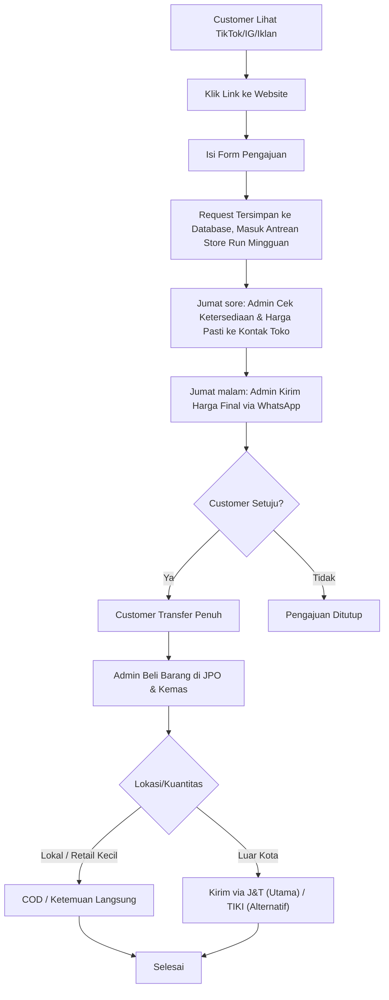
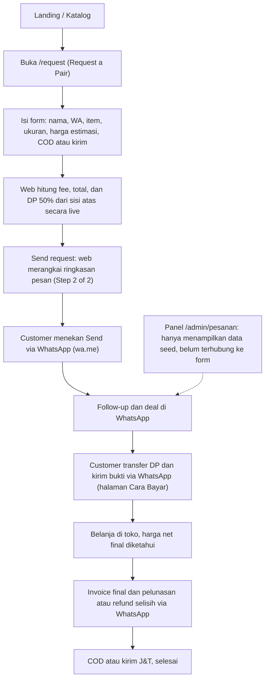

## Document Control

| Field | Value |
|---|---|
| Project Name | PickmenPack |
| Document Type | Business Flow — Order Journey |
| Version | v1.2 |
| Status | Draft |
| Owner | Dicky Qadr Alamsah |
| Related Document | [PRD](PRD.md) Section 5.5 dan 5.8, [Implementation Status](IMPLEMENTATION-STATUS.md) |
| Primary Purpose | Membandingkan alur order yang direncanakan di PRD dengan alur yang benar-benar dijalankan aplikasi saat ini |

> [!info] Order Journey — Target vs As-Built
> *Diagram target mengikuti PRD v1.0 Section 5.5 (model pembayaran baru: cek dulu, baru bayar penuh, tanpa DP). Diagram as-built dibaca dari kode per 21 Sep 2026 — kode belum diupdate mengikuti model baru ini, jadi delta-nya sekarang lebih besar dari sebelumnya.*

---

## Table of Contents

- [1. Target Journey](#1-target-journey)
- [2. As-Built Journey](#2-as-built-journey)
- [3. Delta](#3-delta)
- [4. Order Status Lifecycle](#4-order-status-lifecycle)
- [5. Revision History](#5-revision-history)

---

# 1. Target Journey

Sumber: [PRD](PRD.md) Section 5.5 dan 5.8 (v1.1, berubah total dari v1.8/v1.9 — tidak ada lagi tahap DP).

> [!note] Kenapa lebih pendek dari versi sebelumnya
> *Diagram ini lebih pendek dari versi v1.0 dokumen ini (yang mengikuti PRD sampai v1.9) karena tidak ada lagi tahap DP, antrean pembelian bertahap, alokasi diskon kolektif proporsional, maupun penyesuaian selisih harga — harga sudah final sebelum customer bayar (PRD Section 5.5).*

---

# 2. As-Built Journey

Kode belum diubah sejak audit 21 Sep 2026 — masih mengikuti model DP 50% yang lama, belum mencerminkan keputusan model pembayaran baru (PRD v1.0 Section 5.5).

---

# 3. Delta

| Tahap | Target (PRD v1.0) | As-Built (kode) | Catatan |
|---|---|---|---|
| Pengajuan | Satu jenis form (jalur Corporate/Bulk dihapus 2 Okt 2026) + checkbox Kebijakan Privasi | Form retail saja | Tinggal tambah checkbox privasi |
| Penyimpanan request | Tersimpan ke database, masuk antrean store run | Tidak disimpan; hanya jadi pesan WhatsApp | Sudah diputuskan (22 Sep 2026) untuk dibangun — lihat [Implementation Status](IMPLEMENTATION-STATUS.md) gap #1, #3 |
| Konfirmasi harga | Admin cek ketersediaan & harga pasti dulu, baru kirim angka final (bukan rentang) | Web menghitung estimasi + DP secara otomatis, angka final baru diketahui setelah belanja | Perubahan besar — kode masih pakai alur estimasi-lalu-final, bukan cek-dulu-baru-kuotasi |
| Pembayaran | Customer transfer **penuh** setelah harga dikonfirmasi | Customer transfer **DP 50%** dari sisi atas estimasi | Kode perlu diubah total: hapus logika DP, ganti dengan pembayaran penuh setelah harga fix |
| Pembelian barang | Admin beli **setelah** transfer diterima | Admin beli setelah DP diterima, pelunasan menyusul | Urutan berubah: beli sekarang terjadi setelah pembayaran penuh, bukan sebagian |
| Store run & Belanja Kolektif | Store run mingguan, harga per-item sesuai diskon toko untuk item itu (bukan proporsional) | Tidak ada konsep batch; status hanya `dp` lalu `dibeli` per pesanan | Belum ada konsep batch/jadwal mingguan di data pesanan |
| Selisih harga | Tidak ada lagi — harga sudah final sebelum bayar | Selisih dihitung di panel (`orderMoney`), konfirmasi ulang manual kalau lebih mahal | Logika selisih ini jadi tidak relevan lagi di model baru, perlu dilepas dari alur (walau field datanya mungkin masih berguna untuk audit internal) |
| Pengiriman | COD lokal atau J&T (TIKI alternatif) | COD atau kirim; ongkir diasumsikan Rp30rb–55rb, TIKI tidak dimodelkan | Tidak berubah dari audit sebelumnya |

---

# 4. Order Status Lifecycle

Enum status di kode (`admin/types.ts`) dan padanannya di alur target PRD v1.0:

| Status (kode) | Label di panel | Padanan di alur PRD v1.0 |
|---|---|---|
| `baru` | Request baru | Form masuk, menunggu admin cek ketersediaan & harga |
| `dp` | DP masuk | **Tidak sesuai lagi** — nama status ini mengasumsikan pembayaran sebagian (DP). Di model baru, tahap ini seharusnya berarti "harga dikonfirmasi, menunggu customer transfer penuh" |
| `dibeli` | Dibeli di toko | Barang dibeli & dikemas — di model baru ini terjadi **setelah** pembayaran penuh diterima, bukan setelah DP |
| `dikirim` | Dikirim / COD | Barang dalam pengiriman atau janji COD |
| `selesai` | Selesai | Barang diterima |
| `batal` | Batal | Pengajuan ditutup atau pembayaran dikembalikan |

> [!warning] Gap baru: penamaan status `dp` menyesatkan
> *Kalau model pembayaran baru ini diimplementasikan, nama status `dp` di kode sebaiknya diganti (mis. jadi `harga_dikonfirmasi` dan `dibayar` sebagai dua status terpisah) supaya konsisten dengan alur baru yang tidak lagi punya konsep pembayaran sebagian. Ini gap baru, belum tercatat di [Implementation Status](IMPLEMENTATION-STATUS.md) versi sebelumnya.*

Warna status di panel konsisten dengan [PRD](PRD.md) Section 7.4: kuning untuk menunggu/proses, hijau untuk selesai, merah untuk batal.

---

# 5. Revision History

| Version | Date | Changes |
|---|---|---|
| v1.0 | 21 Sep 2026 | Draft pertama: diagram target dari PRD Section 4 (model DP lama), diagram as-built dari kode, tabel delta, dan pemetaan status. |
| v1.1 | 22 Sep 2026 | Target Journey ditulis ulang mengikuti PRD v1.0 Section 5.5 (model pembayaran baru tanpa DP: cek dulu, baru bayar penuh, baru beli & kemas). Delta table diperbarui — sekarang delta-nya lebih besar karena kode belum diubah dari model lama. Tambah catatan gap baru soal penamaan status `dp` yang tidak lagi sesuai dengan model baru. |
| v1.2 | 2 Okt 2026 | Target Journey mengikuti PRD v1.1: cabang Corporate/Bulk dihapus, langkah cek harga & kirim harga dijadwalkan Jumat (Business Operations Section 2). Delta baris Pengajuan diperbarui. |
