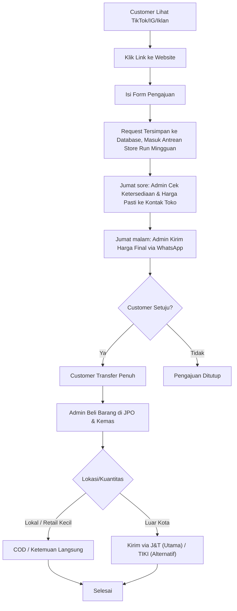
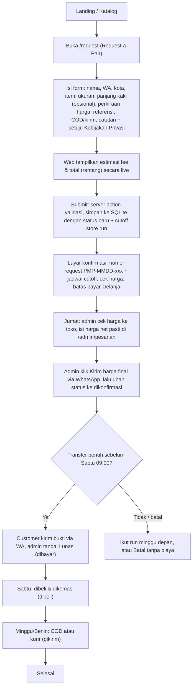

## Document Control

| Field | Value |
|---|---|
| Project Name | PickmenPack |
| Document Type | Business Flow — Order Journey |
| Version | v1.3 |
| Status | Draft — v1.2 sinkron ke Notion 2 Okt 2026; v1.3 (as-built dari kode `f29d642`) belum dipublish |
| Owner | Dicky Qadr Alamsah |
| Related Document | [PRD](PRD.md) Section 5.5 dan 5.8, [Implementation Status](IMPLEMENTATION-STATUS.md) |
| Primary Purpose | Membandingkan alur order yang direncanakan di PRD dengan alur yang benar-benar dijalankan aplikasi saat ini |

> [!info] Order Journey — Target vs As-Built
> *Diagram target mengikuti PRD Section 5.5 (cek dulu, baru bayar penuh, tanpa DP). Diagram as-built dibaca dari kode per 6 Okt 2026 (branch `development`, commit `f29d642`) — alur tanpa DP, penyimpanan request ke database, dan jadwal store run sudah diimplementasikan, jadi delta yang tersisa tinggal hal kecil.*

---

## Table of Contents

- [1. Target Journey](#1-target-journey)
- [2. As-Built Journey](#2-as-built-journey)
- [3. Delta](#3-delta)
- [4. Order Status Lifecycle](#4-order-status-lifecycle)
- [5. Revision History](#5-revision-history)

---

# 1. Target Journey

Sumber: [PRD](PRD.md) Section 5.5 dan 5.8 (v1.1, berubah total dari v1.8/v1.9 — tidak ada lagi tahap DP).

> [!note] Kenapa lebih pendek dari versi sebelumnya
> *Diagram ini lebih pendek dari versi v1.0 dokumen ini (yang mengikuti PRD sampai v1.9) karena tidak ada lagi tahap DP, antrean pembelian bertahap, alokasi diskon kolektif proporsional, maupun penyesuaian selisih harga — harga sudah final sebelum customer bayar (PRD Section 5.5).*

---

# 2. As-Built Journey

Alur di kode sudah sama dengan target. Semua jadwal (cutoff Kamis 23.59, cek harga Jumat, bayar Sabtu 09.00, belanja Sabtu, kirim Minggu/Senin) dihitung `nextStoreRun()` di `request/store-run.ts` dalam WIB.

---

# 3. Delta

| Tahap | Target (PRD) | As-Built (kode) | Catatan |
|---|---|---|---|
| Pengajuan | Satu jenis form + checkbox Kebijakan Privasi | Sesuai, ditambah field panjang kaki (mitigasi salah ukuran, Business Operations 5.2) dan honeypot anti-bot | ✅ Sesuai |
| Penyimpanan request | Tersimpan ke database, masuk antrean store run | Tersimpan ke SQLite (`createOrder`), field `storeRun` = cutoff yang diikuti | ✅ Sesuai |
| Konfirmasi harga | Admin cek harga pasti dulu, kirim **angka final** (bukan rentang) | Admin isi harga net pasti, tapi pesan WhatsApp "harga final" masih menampilkan **rentang** total (fee min–max + ongkir min–max) | 🟡 Gap — perlu input fee & ongkir pasti per order. Lihat [Implementation Status](IMPLEMENTATION-STATUS.md) gap #18 |
| Pembayaran | Transfer **penuh** setelah harga dikonfirmasi | Sesuai — halaman cara bayar, FAQ, dan pesan WA menyebut bayar penuh tanpa DP | ✅ Sesuai |
| Pembelian barang | Admin beli **setelah** transfer diterima | Sesuai urutan status: `dibayar` → `dibeli` | ✅ Sesuai |
| Store run | Mingguan, harga per-item sesuai diskon toko | Jadwal mingguan otomatis; order menyimpan cutoff run. Panel belum mengelompokkan order per run | 🟡 Cukup untuk Fase 1 — filter per run bisa ditambah kalau order banyak |
| Selisih harga | Tidak ada — harga final sebelum bayar | Tidak ada logika selisih di alur. Fungsi lama `allocateGroupDiscount` masih tertinggal di `fee.ts` tanpa pemakai | 🟡 Hapus dead code (Implementation Status gap #19) |
| Pengiriman | COD lokal atau J&T (TIKI alternatif) | COD atau kirim; ongkir estimasi Rp30rb–55rb, ekspedisi tidak dipilih di form | ✅ Cukup — ekspedisi dikonfirmasi di WhatsApp |

---

# 4. Order Status Lifecycle

Enum status di kode (`admin/types.ts`) dan padanannya di alur target:

| Status (kode) | Label di panel | Padanan di alur PRD | Warna |
|---|---|---|---|
| `baru` | Menunggu cek harga | Form masuk, menunggu admin cek ketersediaan & harga (Jumat) | Kuning |
| `dikonfirmasi` | Harga dikirim, tunggu transfer | Harga final sudah dikirim via WA, menunggu transfer penuh (batas Sabtu 09.00) | Kuning |
| `dibayar` | Lunas | Transfer penuh diterima — dihitung sebagai konversi (`isPaid`, PRD Section 8) | Hijau |
| `dibeli` | Dibeli & dikemas | Barang dibeli di toko & dikemas (Sabtu) | Hijau |
| `dikirim` | Dikirim / COD | Dalam pengiriman atau janji COD (Minggu/Senin) | Hijau |
| `selesai` | Selesai | Barang diterima | Hijau tua |
| `batal` | Batal | Batal sebelum transfer (gratis) atau refund stok habis | Merah |

Warna status konsisten dengan [PRD](PRD.md) Section 7.4: kuning untuk menunggu/proses, hijau untuk selesai, merah untuk batal.

---

# 5. Revision History

| Version | Date | Changes |
|---|---|---|
| v1.0 | 21 Sep 2026 | Draft pertama: diagram target dari PRD Section 4 (model DP lama), diagram as-built dari kode, tabel delta, dan pemetaan status. |
| v1.1 | 22 Sep 2026 | Target Journey ditulis ulang mengikuti PRD v1.0 Section 5.5 (model pembayaran baru tanpa DP: cek dulu, baru bayar penuh, baru beli & kemas). Delta table diperbarui — sekarang delta-nya lebih besar karena kode belum diubah dari model lama. Tambah catatan gap baru soal penamaan status `dp` yang tidak lagi sesuai dengan model baru. |
| v1.2 | 2 Okt 2026 | Target Journey mengikuti PRD v1.1: cabang Corporate/Bulk dihapus, langkah cek harga & kirim harga dijadwalkan Jumat (Business Operations Section 2). Delta baris Pengajuan diperbarui. |
| v1.3 | 6 Okt 2026 | As-Built ditulis ulang dari kode commit `f29d642`: request tersimpan ke SQLite, alur tanpa DP, jadwal store run otomatis, layar konfirmasi. Delta diringkas — sebagian besar baris sekarang sesuai; sisa gap: pesan harga final masih rentang (#18) dan dead code `allocateGroupDiscount` (#19). Lifecycle status diganti ke enum baru (`baru`, `dikonfirmasi`, `dibayar`, `dibeli`, `dikirim`, `selesai`, `batal`); callout soal status `dp` dihapus karena sudah resolved. |
