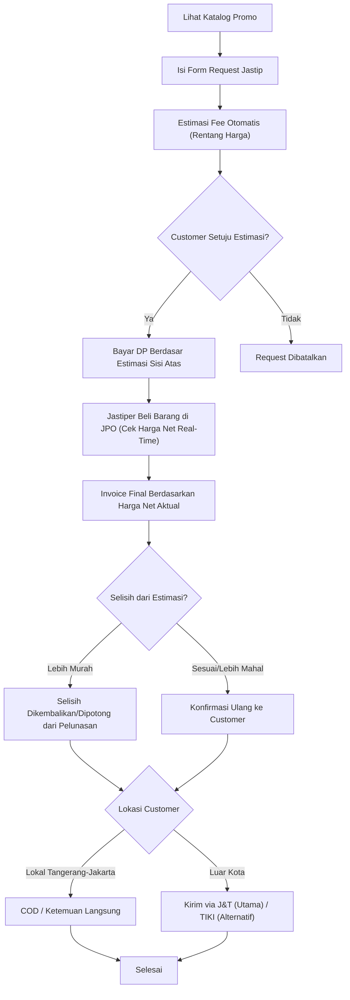

## Document Control

| Field                     | Value                                                                                                                                                                       |
| ------------------------- | --------------------------------------------------------------------------------------------------------------------------------------------------------------------------- |
| Project Name              | KicksPO                                                                                                                                                                     |
| Brand / Jastip Name       | Soletip                                                                                                                                                                     |
| Document Type             | Product Requirements Document (PRD)                                                                                                                                         |
| Version                   | v1.1                                                                                                                                                                        |
| Status                    | Draft                                                                                                                                                                       |
| Owner                     | Dicky Qadr Alamsah                                                                                                                                                          |
| Target Release (MVP)      | Awal Desember 2026 (sebelum puncak promo Natal & Tahun Baru)                                                                                                                |
| Related Portfolio Project | Goposystem (KonserPO) — project terpisah, dicatat sebagai konteks kapasitas waktu solo di bulan Desember 2026                                                               |
| Related Document          | Business & Market Research v1.2 — berisi simulasi perhitungan fee per brand, perbandingan ekspedisi & asuransi, dan dinamika diskon berlapis yang jadi dasar update PRD ini |
| Primary Purpose           | Acuan eksplorasi bisnis dan pengembangan produk untuk jastip sepatu KicksPO                                                                                                 |

<aside>
👟

**_Product Requirements Document (PRD) — KicksPO_**

_Dokumen ini adalah titik awal berpikir soal bisnis jastip sepatu ini: mulai dari bentuk bisnisnya, nama brand & aplikasi, skema fee, sampai perbandingan bikin web app versi sederhana vs full e-commerce. Isinya masih terbuka untuk didiskusikan dan disesuaikan lagi._

</aside>

---

## Table of Contents

---

# 1. Project Overview

## 1.1 Latar Belakang

Ini adalah bisnis pribadi pertama yang mau dijalankan Dicky: jastip (jasa titip beli) sepatu. Idenya berangkat dari momentum musim promo Desember — banyak diskon besar menjelang Harbolnas 12.12, _End of Season Sale_ (EOSS), dan periode Natal & Tahun Baru — ditambah keuntungan lokasi, karena ada Mall JPO di dekat Dicky yang harga sepatunya cukup miring dibanding tempat lain.

Selama ini jastip pada umumnya dijalankan manual lewat chat WhatsApp: request masuk campur aduk dengan chat lain, estimasi biaya dihitung manual satu-satu, dan riwayat pesanan gampang tercecer kalau volume chat lagi ramai (apalagi pas musim promo begini). Karena Dicky juga terbiasa bikin web app untuk project-project sebelumnya, project ini sekaligus jadi kesempatan buat bikin platform sendiri yang lebih rapi dari WhatsApp manual.

## 1.2 Peluang & Momentum

- **Musim promo Desember** — kombinasi Harbolnas 12.12, EOSS, dan belanja Natal/Tahun Baru bikin traffic pencarian sepatu diskon naik signifikan di periode ini.
- **Keunggulan lokasi** — akses langsung ke Mall JPO yang harganya cukup miring jadi nilai jual utama dibanding jastiper lain yang gak punya akses serupa.
- **Barang "kelihatan langsung"** — karena belanja fisik di mall (bukan titip dari e-commerce), Dicky bisa cek kondisi barang, ukuran, dan keaslian sebelum diteruskan ke customer — nilai tambah dibanding jastip online biasa.

## 1.3 Goals & Objectives

1. Memvalidasi model bisnis jastip sepatu solo dengan effort development minim, siap sebelum musim promo Desember 2026
2. Memberi calon customer cara request yang lebih rapi & transparan dibanding chat WhatsApp manual
3. Menentukan skema fee yang jelas dan konsisten sejak awal, supaya gak dadakan mikir margin tiap ada order
4. Membangun pondasi produk yang bisa berkembang jadi e-commerce penuh kalau model bisnisnya terbukti jalan

## 1.4 Success Metrics (KPI Sederhana)

| Metric                                         | Target Musim Desember 2026                                                  |
| ---------------------------------------------- | --------------------------------------------------------------------------- |
| Jumlah request masuk per minggu (puncak promo) | Baseline awal — dicatat dulu, jadi acuan target musim berikutnya            |
| Konversi request → order terbayar              | ≥ 40%                                                                       |
| Rata-rata waktu respons ke customer            | &lt; 2 jam di jam operasional                                               |
| Repeat customer rate                           | Dicatat sebagai indikator kepercayaan, belum ditarget angka pasti di Fase 1 |

---

# 2. Model Bisnis

## 2.1 Bentuk Bisnis

<aside>
🧍

_Fase 1 dijalankan sebagai solo jastiper — Dicky sendiri yang megang mulai dari terima request, beli barang di JPO, sampai kirim/COD ke customer. Belum dibuka jadi platform multi-jastiper; opsi ini bisa dipertimbangkan lagi kalau demand-nya sudah terbukti besar di musim-musim berikutnya._

</aside>

## 2.2 Target Pasar & Jangkauan

| Segmen                      | Metode                                                                                                                                                                                                              | Catatan                                                                                                                                                                                                       |
| --------------------------- | ------------------------------------------------------------------------------------------------------------------------------------------------------------------------------------------------------------------- | ------------------------------------------------------------------------------------------------------------------------------------------------------------------------------------------------------------- |
| Tangerang & Jakarta (lokal) | COD / ketemuan langsung                                                                                                                                                                                             | Gak ada ongkir, cocok buat validasi awal & bangun trust lewat ketemu langsung                                                                                                                                 |
| Luar kota (nasional)        | Kirim paket via ekspedisi — **J&T Express** jadi default utama (plafon ganti rugi asuransi hingga Rp20 juta, paling cocok untuk sepatu &gt; Rp1 juta), dengan **TIKI** sebagai alternatif kedua (plafon Rp2,5 juta) | Ongkir + packing tambahan ditanggung customer; barang wajib difoto/video sebelum dikirim sebagai bukti kondisi & syarat klaim asuransi. Detail perbandingan ekspedisi: Business & Market Research Section 5.6 |

## 2.3 Sumber Barang — Mall JPO

Semua barang dibeli langsung di gerai resmi/counter di Mall JPO, bukan reseller atau marketplace pihak ketiga — ini jadi salah satu nilai jual utama (barang bisa dicek fisiknya langsung sebelum dibeli). Perlu dicatat sebagai kebijakan: jastiper hanya membeli dari counter/toko resmi di JPO untuk menjaga keaslian barang.

## 2.4 Skema Fee / Harga

| Opsi                     | Skema                                                                                                       | Kelebihan                                                                                                   | Kekurangan                                                                                                       |
| ------------------------ | ----------------------------------------------------------------------------------------------------------- | ----------------------------------------------------------------------------------------------------------- | ---------------------------------------------------------------------------------------------------------------- |
| A — Fee Tetap Bertingkat | &lt; Rp500rb: Rp25rb–35rb • Rp500rb–1jt: Rp40rb–60rb • &gt; Rp1jt: Rp75rb atau 5–7% (mana yang lebih besar) | Margin tetap terjaga meski harga barang lagi didiskon besar; gampang dikomunikasikan ke customer sejak awal | Perlu update tabel kalau ada perubahan rentang harga                                                             |
| B — Persentase Flat      | 8–10% dari harga barang, minimum Rp25rb                                                                     | Simpel, satu angka buat semua harga                                                                         | Fee ikut turun kalau barang lagi diskon besar — padahal effort jastiper sama saja, kurang cocok buat musim promo |

<aside>
💡

_Rekomendasi: Opsi A (Fee Tetap Bertingkat). Karena momentum utama project ini justru musim diskon besar, skema persentase (Opsi B) berisiko bikin margin jastiper ikut mengecil padahal proses belanja & antar tetap sama repotnya. Fee tetap bertingkat lebih menjaga margin dan lebih mudah dijadikan angka pasti di halaman kalkulasi estimasi fee pada aplikasi._

</aside>

<aside>
⚖️

_Aturan penting: fee selalu dihitung dari harga NET final setelah semua diskon toko (bukan dari harga awal sebelum diskon) — karena diskon di toko sering berlapis dan "hingga X%" bukan angka pasti, harga net baru diketahui setelah barang benar-benar dibeli. Simulasi lengkap & contoh perhitungan berlapis ada di Business & Market Research Section 5.2, 5.5, dan 5.7._

</aside>

---

# 3. Brand & Naming

## 3.1 Nama Jastip (Brand)

| Nama          | Makna / Filosofi                                                                                                 |
| ------------- | ---------------------------------------------------------------------------------------------------------------- |
| **Soletip**   | "Sole" (bagian sepatu) + "Titip" — pendek, gampang diucap & diingat, kesannya modern dan bisa dipakai dua bahasa |
| StepMiring    | Plesetan "harga miring" + "Step" (langkah/sepatu) — unik, lokal banget, gampang nempel di ingatan                |
| Titip Kicks   | "Kicks" istilah gaul buat sneakers + "Titip" — jelas dan langsung nyambung ke komunitas sneakerhead              |
| JPO Kicks     | Langsung menyebut sumber barang (Mall JPO) — bangun trust "asli dari JPO" sejak dari nama                        |
| Langkah Titip | Permainan kata "langkah" (jejak/sepatu) — lebih santai dan terasa Indonesia banget                               |

<aside>
✅

_Rekomendasi: Soletip. Nama pendek, gampang dijadikan handle sosial media & domain (misal soletip.id), enak diucapkan dalam bahasa Indonesia maupun Inggris, dan masih fleksibel kalau nanti mau expand ke jastip fashion item lain di luar sepatu._

</aside>

## 3.2 Nama Aplikasi (Platform)

| Nama        | Makna / Filosofi                                                                                                                                                                            |
| ----------- | ------------------------------------------------------------------------------------------------------------------------------------------------------------------------------------------- |
| **KicksPO** | "Kicks" (sneakers) + "PO" (Pre-Order) — mengikuti pola penamaan yang sudah dipakai di project Goposystem kamu (KonserPO), jadi konsisten sebagai bagian dari "keluarga" platform PO milikmu |
| SoleFlow    | Menekankan alur (flow) proses dari request sampai barang sampai ke customer                                                                                                                 |
| StepCart    | Kombinasi "Step" + "Cart" (belanja), lebih terasa e-commerce                                                                                                                                |
| Titipin.id  | Nama generik, terbuka dipakai buat kategori jastip lain di masa depan (gak terikat ke sepatu doang)                                                                                         |
| SneakPO     | Variasi lain dari pola PO, lebih spesifik menyasar niche sneakers                                                                                                                           |

<aside>
✅

_Rekomendasi: KicksPO. Selain catchy, nama ini konsisten dengan pola "[Kata Kunci]PO" yang sudah kamu pakai di KonserPO (Goposystem) — jadi kalau nanti ada project PO lain, ini bisa kerasa seperti satu ekosistem platform pre-order yang kamu bangun sendiri. "PO" juga langsung menjelaskan cara kerja jastip: customer bayar dulu, baru barang dibelikan._

</aside>

---

# 4. Customer Journey

<aside>
📝

_Alur di atas sudah mengikuti skema kuotasi "estimasi-rentang lalu invoice final" dari Business & Market Research Section 5.7 — bukan angka pasti sejak awal, karena harga net baru pasti setelah barang benar-benar dibeli di JPO._

</aside>

---

# 5. Web App — MVP Simple vs Full E-Commerce

<aside>
🧭

_Ini bagian yang paling penting buat didiskusikan: mau langsung bikin full e-commerce, atau mulai dari versi sederhana dulu? Tabel di bawah membandingkan keduanya._

</aside>

| Aspek                | MVP Simple                                                                                                              | Full E-Commerce                                                    |
| -------------------- | ----------------------------------------------------------------------------------------------------------------------- | ------------------------------------------------------------------ |
| Katalog              | Landing page + daftar promo, diupdate manual oleh Admin                                                                 | Katalog dinamis dengan search & filter, kategori                   |
| Order                | Form request → estimasi fee otomatis (rentang) → checkout, invoice final & settlement selisih tetap manual via WhatsApp | Cart & checkout otomatis langsung di web                           |
| Pembayaran           | Transfer manual + upload bukti bayar                                                                                    | Payment gateway otomatis (Midtrans/Xendit)                         |
| Tracking             | Update status manual lewat WA                                                                                           | Tracking status otomatis real-time di web + notifikasi             |
| Akun Customer        | Tidak perlu login                                                                                                       | Ada akun & riwayat order                                           |
| Estimasi Waktu Build | Cepat (± 2–4 minggu)                                                                                                    | Lebih lama (± 2–3 bulan)                                           |
| Paling Cocok Untuk   | Validasi cepat model bisnis sebelum musim promo Desember ini                                                            | Setelah model bisnis & demand sudah terbukti dari musim sebelumnya |

<aside>
✅

_Rekomendasi: mulai dari MVP Simple untuk musim Desember 2026 ini — waktu persiapan yang tersedia (± 4 bulan, beririsan juga dengan project Goposystem) lebih realistis buat versi sederhana. Struktur data & fee disiapkan sejak awal supaya gampang di-upgrade ke Full E-Commerce di Fase 2 begitu model bisnisnya sudah terbukti jalan._

</aside>

---

# 6. Scope

## 6.1 In Scope (Fase 1 — Simple MVP)

- Landing Page & Katalog Promo (list sepatu/promo yang lagi ready di JPO, update manual oleh Admin)
- Form Request Jastip (nama, item, ukuran, budget, link/foto referensi, kontak WhatsApp)
- Kalkulasi Estimasi Fee Otomatis (rentang harga, mengikuti skema tiered di Section 2.4 — bukan angka pasti, lihat Business & Market Research Section 5.7)
- Info Cara Pembayaran & Rekening/QRIS Tujuan
- Halaman FAQ & Kebijakan (DP, refund, estimasi waktu proses, kebijakan settlement selisih harga)
- Halaman Testimoni/Portfolio (bangun trust dari order-order awal, termasuk kasus selisih harga yang dikembalikan)

## 6.2 Out of Scope (Fase 1)

<aside>
🚫

_Fitur berikut belum masuk MVP dan sebaiknya ditunda ke Fase 2: Cart & Checkout otomatis, Payment Gateway (Midtrans/Xendit), Order Tracking real-time otomatis, Akun Customer/Login, dan dukungan multi-jastiper._

</aside>

## 6.3 Roadmap Fase 2 — Full E-Commerce (Kalau Sudah Tervalidasi)

- Cart & checkout online penuh
- Payment gateway otomatis (Midtrans/Xendit)
- Order tracking otomatis + notifikasi status
- Akun customer dengan riwayat order
- Ekspansi kategori (tas, baju, aksesoris, dst.) di luar sepatu

---

# 7. Tech Stack

| Category     | Fase 1 (Simple MVP)                                    | Fase 2 (Full E-Commerce)           |
| ------------ | ------------------------------------------------------ | ---------------------------------- |
| Framework    | Next.js (App Router), TypeScript                       | Sama, dilanjutkan                  |
| Styling / UI | Tailwind CSS, shadcn/ui                                | Sama, dilanjutkan                  |
| Data         | Form submission sederhana (belum perlu database penuh) | Prisma ORM + Supabase (PostgreSQL) |
| Validasi     | Zod                                                    | Zod (dilanjutkan)                  |
| Payment      | Manual Transfer/QRIS + upload bukti bayar              | Midtrans/Xendit                    |
| Deploy       | Vercel                                                 | Vercel (dilanjutkan)               |

<aside>
🔧

_Stack Fase 1 sengaja disamakan dengan stack Goposystem (Next.js, Tailwind, shadcn) meskipun project-nya terpisah, supaya gak perlu switch context teknis yang beda-beda sebagai solo developer yang mengerjakan dua project bersamaan._

</aside>

---

# 8. Design Guidelines

- **Layout:** Mobile-first (customer kemungkinan besar akses dari HP saat lihat promo), card-based untuk katalog, alur form request singkat (idealnya di bawah 5 langkah)
- **Warna:** Palet yang terasa clean & trustworthy (bukan terlalu ramai), dengan warna status konsisten kalau nanti ada tracking: hijau (Dikonfirmasi/Selesai), kuning (Menunggu/Diproses), merah (Ditolak/Batal)
- **Konten:** Testimoni dan foto barang asli dari pembelian sebelumnya ditampilkan jelas — penting untuk bangun trust sebagai jastiper baru

---

# 9. Assumptions & Constraints

### Assumptions

- Operasional dijalankan solo oleh Dicky sebagai satu-satunya jastiper di Fase 1
- Fokus wilayah lokal Tangerang-Jakarta (COD), luar kota via ekspedisi
- Pembayaran manual (transfer/QRIS pribadi), belum terhubung payment gateway resmi

### Constraints

- Waktu development beririsan dengan project Goposystem (KonserPO) yang juga target Desember 2026 — perlu diatur prioritas & waktu supaya dua-duanya tetap jalan
- Stok & harga di Mall JPO bisa berubah sewaktu-waktu tanpa kendali penuh dari jastiper
- Belum ada modal/tim tambahan; talangan pembelian barang bergantung pada kebijakan DP/pelunasan dari customer

---

# 10. Risks & Mitigation

| Risk                                                                         | Impact                                               | Mitigation                                                                                                                                                                                                                            |
| ---------------------------------------------------------------------------- | ---------------------------------------------------- | ------------------------------------------------------------------------------------------------------------------------------------------------------------------------------------------------------------------------------------- |
| Stok/ukuran habis saat jastiper sampai di JPO                                | Request gagal, customer kecewa                       | Konfirmasi ketersediaan real-time dulu sebelum invoice final dikirim                                                                                                                                                                  |
| Harga berubah antara waktu request dan waktu beli                            | Margin jastiper tergerus atau komplain dari customer | Invoice final hanya berlaku dalam batas waktu tertentu (misal 24 jam), setelah itu perlu konfirmasi ulang harga                                                                                                                       |
| Customer tidak melunasi setelah barang dibeli                                | Jastiper menanggung barang tanpa pembeli             | Kebijakan DP/pelunasan di depan sebelum barang dibeli, dikomunikasikan jelas sejak form request                                                                                                                                       |
| Barang rusak/hilang saat pengiriman ke luar kota                             | Kerugian finansial & kepercayaan                     | Dokumentasi foto/video sebelum kirim; utamakan J&T Express untuk barang &gt; Rp1 juta (plafon ganti rugi hingga Rp20 juta), declare nilai barang sesuai harga aktual, ikuti tips packing di Business & Market Research Section 5.6    |
| Estimasi harga meleset jauh dari harga net final akibat diskon berlapis toko | Customer kaget/komplain soal selisih harga           | Pakai skema kuotasi estimasi-rentang lalu invoice final (Business & Market Research Section 5.7); selisih ke arah lebih murah selalu dikembalikan ke customer, selisih ke arah lebih mahal wajib konfirmasi ulang sebelum lanjut beli |
| Kapasitas waktu solo beririsan dengan Goposystem (sama-sama Desember 2026)   | Salah satu atau kedua project telat/kurang maksimal  | Prioritas project ini diset Medium (vs Goposystem Hight); pilih MVP Simple agar cepat selesai dan tidak menyita waktu berlebihan                                                                                                      |

---

# 11. Timeline & Milestones

| Milestone | Target Waktu        | Fokus                                                             |
| --------- | ------------------- | ----------------------------------------------------------------- |
| M0        | Agustus 2026        | Finalisasi model bisnis, nama brand, dan PRD ini                  |
| M1        | September 2026      | Build MVP Simple: landing page, katalog, form request             |
| M2        | Oktober 2026        | Soft launch ke circle terdekat, kumpulkan testimoni awal          |
| M3        | November 2026       | Promosi ke media sosial, sinkronisasi info promo terbaru dari JPO |
| M4        | Awal Desember 2026  | Go-Live menjelang puncak musim promo (Harbolnas 12.12, EOSS)      |
| M5        | Akhir Desember 2026 | Evaluasi hasil musim promo, mulai susun requirement Fase 2        |

---

# 12. Open Questions

| #   | Topik            | Pertanyaan Terbuka                                                                                    | Status                                                                                                                         |
| --- | ---------------- | ----------------------------------------------------------------------------------------------------- | ------------------------------------------------------------------------------------------------------------------------------ |
| 1   | Modal & Talangan | Apakah perlu modal talangan buat beli barang sebelum customer lunas, atau full DP/pelunasan di depan? | Open                                                                                                                           |
| 2   | Radius Lokal     | Wilayah pasti mana saja yang dianggap "lokal" untuk opsi COD?                                         | Open                                                                                                                           |
| 3   | Ekspedisi        | Ekspedisi mana yang dipakai untuk kirim ke luar kota (JNE/J&T/SiCepat/lainnya)?                       | Resolved — J&T Express (utama, plafon ganti rugi tertinggi), TIKI (alternatif). Detail: Business & Market Research Section 5.6 |
| 4   | Kapasitas Waktu  | Bagaimana pembagian waktu riil di bulan Desember mengingat Goposystem juga berjalan bersamaan?        | Open                                                                                                                           |
| 5   | Nama Final       | Apakah Soletip & KicksPO sudah final, atau masih mau eksplorasi opsi lain di Section 3?               | Open                                                                                                                           |

---

# 13. Revision History

| Version | Date        | Changes                                                                                                                                                                                                                                                                                                              |
| ------- | ----------- | -------------------------------------------------------------------------------------------------------------------------------------------------------------------------------------------------------------------------------------------------------------------------------------------------------------------- |
| v1.0    | 13 Aug 2026 | Draft awal PRD: eksplorasi model bisnis, brainstorm nama brand (Soletip) & aplikasi (KicksPO), skema fee, dan perbandingan MVP Simple vs Full E-Commerce.                                                                                                                                                            |
| v1.1    | 13 Aug 2026 | Sinkronisasi dengan Business & Market Research v1.2: update ekspedisi default ke J&T Express (plafon asuransi tertinggi), tegaskan fee dihitung dari harga net final, ubah Customer Journey jadi skema estimasi-rentang lalu invoice final dengan settlement selisih, tambah risk & resolve Open Question ekspedisi. |
