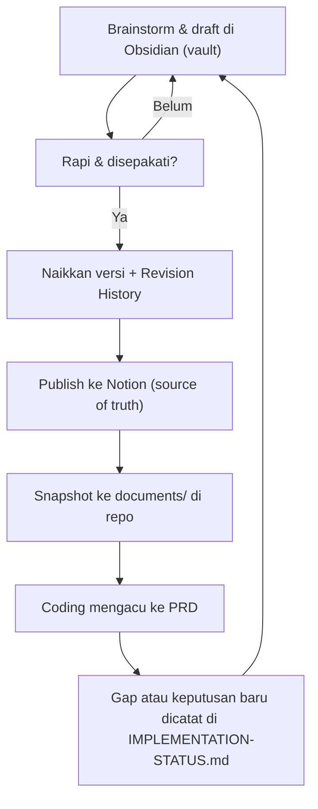

# Project Documents

> **Dokumen PickmenPack**
> *Folder ini berisi dokumen yang dibutuhkan saat coding. Sumber utama dokumen bisnis ada di Notion, drafnya ditulis di vault Obsidian. Alur lengkapnya ada di bawah.*

## Files

| File | Isi | Ditulis di | Versi |
|---|---|---|---|
| `PRD.md` | Product Requirements Document PickmenPack | Vault Obsidian (`docs/`), lalu dipublish ke Notion | Snapshot v1.2 (6 Okt 2026). Sama dengan Notion (9 Okt 2026) |
| `BUSINESS-OPERATIONS.md` | Siklus mingguan, kebijakan harga/stok/refund/retur, rekening, legal | Vault, lalu Notion | Snapshot v0.1 (6 Okt 2026) |
| `ORDER-JOURNEY.md` | Alur order target vs as-built dan lifecycle status order | Vault, lalu Notion | Snapshot v1.4 (9 Okt 2026). Sama dengan Notion |
| `IMPLEMENTATION-STATUS.md` | Apa yang sudah dibangun dibanding PRD, daftar gap, dan checklist go-live | Repo (folder ini) | v1.3 (9 Okt 2026), sudah di vault & Notion |
| `DESIGN-SYSTEM.md` | Design system UI "Clean Commerce + Pop" (token, komponen, aturan visual) | Repo | — |
| `README.md` | Alur dokumentasi (file ini) | Repo | — |

Tidak di-snapshot ke sini (hanya di vault): Business & Market Research, Unit Economics, dan Landing Page Content — yang terakhir jadi acuan copy di `src/modules/home/content.ts`.

## Documentation Flow

## Rules

- **Notion adalah source of truth.** Kalau isi file di sini beda dengan Notion, Notion yang benar.
- **Jangan edit `PRD.md` di sini.** Itu snapshot. Koreksi dilakukan di draft vault, dipublish ke Notion, lalu snapshot di-regenerate.
- **`IMPLEMENTATION-STATUS.md` ditulis di repo** karena terikat kode. Salinannya di vault dibuat dari file ini.
- Setiap revisi menaikkan versi dan menambah satu baris di Revision History.
- Commit perubahan dokumen terpisah dari perubahan kode.

## Links

- Notion: [Project](https://app.notion.com/p/3bb5b010daef815e9116e76ca6025a5d) · [PRD](https://app.notion.com/p/3bb5b010daef81ce9dc7d76446453019) · [Business & Market Research](https://app.notion.com/p/3bb5b010daef81d8885cd66643ebab07)
